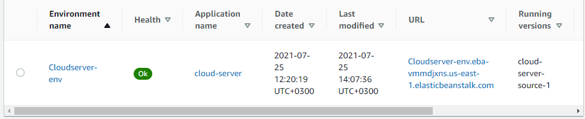

# cloud-server
## Lab - 16

## Author :  ✨ ✨ Mohammad Altamimi
---

## Description 
-  In this app I created a simple API that shows the Arab countries population in a json format ranked descendingly.

 

## Environement varaible

> PORT=

 

# Deployed server using AWS Elastic Beanstalk
✨✨ [Click here](http://cloudserver-env.eba-vmmdjxns.us-east-1.elasticbeanstalk.com/)

 

> To access the data in JSON format use the route  `'/data'`.

 
 
 

# The process
 

1. I set up the API server.
2. checked all the routes locally.
3. zipped all the needed files for Beanstalk.deployment ( Code, public, package.json). 
 

> use 7-zip not WinRar
 

4. open your aws console
5. Go to beanstalk service
6. craete a new app
7. choose local file to deploy from
8. pick the zipped folder
9. wait until the deployment is done and fix any errors you may face.
10. when the Health shows you an `ok` signal click on the URL provided.
 
 

